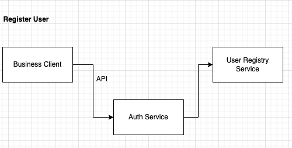
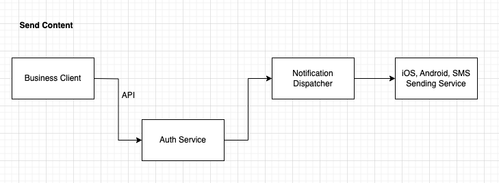
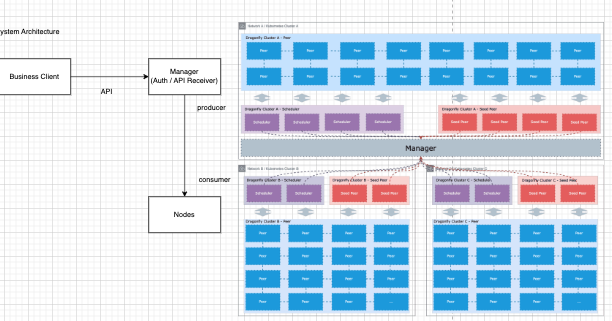

**## 요구 사항 정의
### 기능 요구 사항(Functional Requirements) - 책에 없음
```text
1. 유저의 이름과, 알림을 받을 단말의 정보(들), 수신 허용 기간, 수신 허용 여부를 보유한다.
    - 단말의 정보 : 핸드폰(iOS, Android), 이메일, SMS 중 하나
    - 도중에 모든 정보를 수정할 수 있도록 지원한다.
    - 수신 허용 기간을 벗어난 유저의 정보는 지체 없이 파기한다.
2. 알림은 해당 기업(클라이언트)에서의 API 콜을 통해 이루어지며, 그룹을 명시할 수 있다.
    - 알림은 텍스트이며, 1500 bytes 이내여야 한다.
    - 알림은 요청 시각으로부터 10~30분 이내 이루어진다. (회사 별 다른 조건)
3. 모든 발생한 로그 정보는 기록한다.
```
### 비기능 요구 사항(Non-Functional Requirements) - 책에 없음
```text
1. 유저 추가 및 알림 발송에 대해 보안성을 높인다.
2. 각 유저별로 알림 전송의 단계마다 이벤트를 추적하고 모니터링한다.
3. Soft-Realtime을 지원한다.
4. 모든 단계에 대해 Failover를 지원한다. 
    - 제 3자 제공 서비스에 대한 Failover 또한 고려한다.
```

## 사용자 및 트래픽 분석 - 책에 없음
- Company = 10
- User per company = 50,000,000 Average
- Device per User = 2
- Notification per Day = 3
- Maximum QPS = 3
- Every 100,000 User being Added, with 1 year expiration
### Daily Active Users
- Company * User per company * Device per User = 1,000,000,000
- 
### Read-to-Write Ratio
- There are no Read-to-write Ratio
### Usage Patterns
### Peak and Seasonal Events

## 데이터베이스 설계
### Users Table

| Key         | Type                  | Description          |
|-------------|-----------------------|----------------------|
| UserID      | Auto Increment BigInt | 유저의 고유 식별자   |
| Username    | String                | 유저의 이름          |
| ExpireDate  | String                | 유저의 계정 만료 날짜 |
### Groups Table

| Key         | Type                  | Description          |
|-------------|-----------------------|----------------------|
| GroupID     | Auto Increment BigInt | 그룹의 고유 식별자   |
| GroupName   | String                | 그룹의 이름          |
### UserGroups Table

| Key         | Type                  | Description         |
|-------------|-----------------------|---------------------|
| UserID      | BigInt                | Users 테이블의 UserID |
| GroupID     | BigInt                | Groups 테이블의 GroupID |
### Devices Table

| Key          | Type                  | Description            |
|--------------|-----------------------|------------------------|
| DeviceID     | Auto Increment BigInt | 디바이스의 고유 식별자 |
| UserID       | BigInt                | Users 테이블의 UserID  |
| OS           | String                | 디바이스의 운영체제    |
| DeviceToken  | String                | 디바이스 토큰          |
### SQL: 데이터 조작 및 관리를 위한 쿼리 언어를 선택합니다.

```
SELECT 
    Devices.DeviceID,
    Devices.UserID,
    Devices.OS,
    Devices.DeviceToken
FROM 
    Devices
INNER JOIN 
    Users ON Devices.UserID = Users.UserID
INNER JOIN 
    UserGroups ON Users.UserID = UserGroups.UserID
WHERE 
    UserGroups.GroupID = [제공된 그룹 ID];
```


## API 디자인
### HTTP Verb & Request-Response Headedrs and Contract
### Data Format: JSON, XML, Protocol Buffer 등 데이터 교환 포맷을 선택합니다.

## 용량 계획
### Query Per Second (Read-Write)
- AddUser : 50000000/(365×24×60×60) = 1.5 API call/second.
- SendNoti: API-B 50000000 X2X3X3=9e8 API Call/second

### Bandwidth (Read-Write)
- Assume that 1 API Call ~= 1MB 
- 90TB/second =7200GBps. = 100GBPS X 72

### Storage: 필요한 저장 공간을 계획합니다.
### Memory

## 고수준 디자인
### Basic Algorithm
### Data Flow





### Tradeoffs
### Alternatives
7. 네트워크 프로토콜
TCP, UDP, REST, RPC, WebSocket, SSE, Long Polling 등과 같은 네트워크 프로토콜을 선택하고 구현합니다.
8. 클라우드 패턴
CQRS, Publish-Subscribe, Serverless Functions 등 현대적인 클라우드 아키텍처 패턴을 적용합니다.
9. 데이터 구조 및 알고리즘
CRDT, Trie, Bloom Filter, HyperLogLog, Count-Min Sketch 등의 데이터 구조와 알고리즘을 적절히 활용하여 성능과 확장성을 개선합니다.
10. 분산 시스템
Coordination Service: Zookeeper와 같은 조정 서비스를 사용하여 클러스터 관리 및 분산 시스템의 일관성을 유지합니다.
Distributed Transactions: Two-Phase Commit, Sagas와 같은 분산 트랜잭션 처리 방법을 적용합니다.
11. 모니터링, 로깅 및 알림
시스템의 상태를 모니터링하고, 로그를 기록하며, 문제 발생 시 알림을 설정합니다.
12. 배포 및 보안
Deployment: 시스템을 안정적으로 배포하는 전략을 수립합니다.
Security: 인증(Authentication) 및 인가(Authorization) 방식을 결정하고, 보안 취약점을 방지합니다.
13. 컴포넌트 및 애플리케이션 레이어
DNS, CDN, Load Balancer, Reverse Proxy 등과 같은 네트워크 컴포넌트를 설계하고 구성합니다.
Microservices, Service Discovery, SQL/NoSQL Data Store, Message Queue 등 애플리케이션 레이어의 구성 요소를 설계합니다.
이러한 요소들을 단계별로 고려하며 시스템을 설계하면, 복잡한 시스템도 체계적이고 효과적으로 구축할 수 있습니다.
