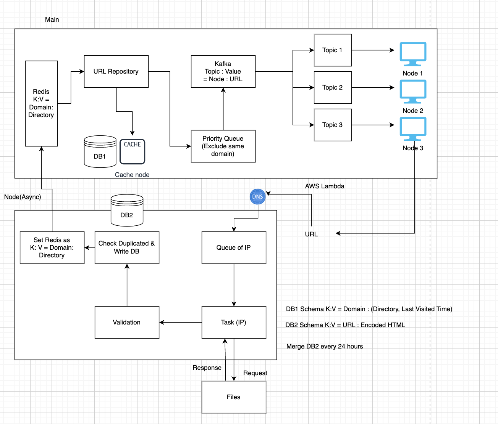

# Web-Crawlers
## Definition / Usage of Web Crawlers.
### Definition
- Web Crawlers is an internet bot for finding systematically browses the content of World Wide Web.

### Usage
- Serach Engine Indexing (i.e. Google Search Engine)
- Web archiving
- Web mining
- Web monitoring

We will look into `Search Engine Indexing`

## Building User Requirements
### Collecting User's needs with Assumptions
```text

Purpose: The crawler's main purpose is for search indexing.

Data Volume: The objective is to gather approximately 1 billion web pages each month. 
Given the web's extensive size (around 60 trillion pages), this pace would require about 30 years to cover the entire web.

Regular Updates: The crawler should efficiently identify and index web pages that are newly created or have undergone modifications.

Long-Term Storage: store the collected web pages for a duration of 5 years, emphasizing the elimination of duplicate content.

Multi-Language: Language variations do not need to be a consideration in the crawling process.
```
### Additional Assumptions from the Developer's Perspective
```text
Legal Considerations: Given the hypothetical nature of this exercise, legal aspects are not a concern.

Robustness: The crawler must be resilient against potential threats such as malware, unresponsive servers, and flawed codes.

Politeness: The crawler should avoid sending excessive requests to the same page in a short timeframe.

High-Performance: The code should be optimized for high performance, including capabilities for parallel processing.

Scability: Since traffic is consistent, we don't need to care of scability.

Cost : Concern Hardware Architecture be cheap.

Extensibility: The code structure must be adaptable to accommodate a variety of evolving needs and potential modifications.
```

## Infra
### Estimation 
QPS
|Index| Content                                                           |
|---|-------------------------------------------------------------------|
|QPS(read)| 1 billion / 30 days / 24 hours / 3600 seconds ~= 400 pages/second |
|Maximum QPS(read)| 2 *400 pages/second = 800 pages/second |
|QPS(write) | Same as QPS(read), or (1-duplicated_ratio)*QPS(read)             |

Storage
- 1 billion/month * 500kb/pages * 12 month * 30 years = 4800 billion KB = 120000 TB
 - Consider that single Magnetic Tape ~= 200 TB
    - Also, We need consideration of Write I/O.

In-Memory 
- No In-memory space.
- We may use it for cache, but not necessary.

GPU
- No GPU being used, for now.
- I/O Bound > CPU Bound Task

Database Read/Write
- find page list: 400 ops/second
- write page list : 400 ops/second

Network Bandwidth
- 800 pages * 500kb  = 800 pages * 500kb * 8bit * (kb/1000bit)*(mb/1000kb) = 50 Mbps

Conclusion
- `Constructing Large Storage` is the most problem
- Not concern of `network`, `Database I/O` on current status. 
- High concern of `response time`

## Architecture
### Components
1. URL Repository
   - Feature
      - List of URLs to be traversed (URLs to visit and update) 
        - URL to be traversed
        - URL to be updated (with update policy. We cannot traverse all.)
   - Consideration
     - Maintain a list of URLs in memory
     - Caching mechanism for faster updates (with caching policy)
     - Make priority
   - Communication with next module
     - Kafka
       - Easy for communicating with cluster by task
       - Can Divide priority
       - Producer & Consumer pattern

2. HTML Downloader & Validator (by cluster, Async)
    
    A. HTML Downloader
    - Feature
      - Download HTML files from web pages
      - Requires DNS Resolver for hostname resolution
     - Considerations
       - How to manage Async Tasks 
       - Communcation with next Module

    B. HTML File Validator & Duplicated HTML Checker
   - Feature
     - Validate HTML & Gather next URL
     - Manage by each database
     - Write HTML Files on database
   - Communication with next module
     - Redis
       - Key Value Store with next url.
       - Sequence is not important.


3. RSS Feed Analyzer (optional)
   - Analyze RSS feeds if needed for content updates

### Software Diagram


## In detaiils
### Algorithm
1. Graph Traversal Considerations
   - DFS 
     - Critical when large depth
     - Hard for Parallel Computing
   - BFS
     - Impolite Crawler Traverse similar-links in order
       - Make queue by domain (Lock single domain)
   - Both
     - Priority: Need to be prioritized based on user's choice
        - Based on Priority Queue

### Optimization
Performance
1. Distributed 
    - Treated on above
2. Caching
    - Caching URL Repository
      - 8Gb / 1Kb = 8e6 (pages)
    - Caching Mapping Table(Back-Q)
3. Locality
    - Locate Cache Server on every region
      - Does region matter on ISP?
      - or region matter on Routing Table?
4. Timeout
    - Short Timeout

## Further Talk
### Link with Machine Learning
## Reference
https://docs.aws.amazon.com/msk/latest/developerguide/mkc-create-topic.html
- Kafka로 우선순위를?: https://community.aws/posts/prioritizing-event-processing-with-apache-kafka
- Resequencer : https://www.enterpriseintegrationpatterns.com/patterns/messaging/Resequencer.html
- Smart Endpoint and Dummy Pipe: https://martinfowler.com/articles/microservices.html#SmartEndpointsAndDumbPipes
